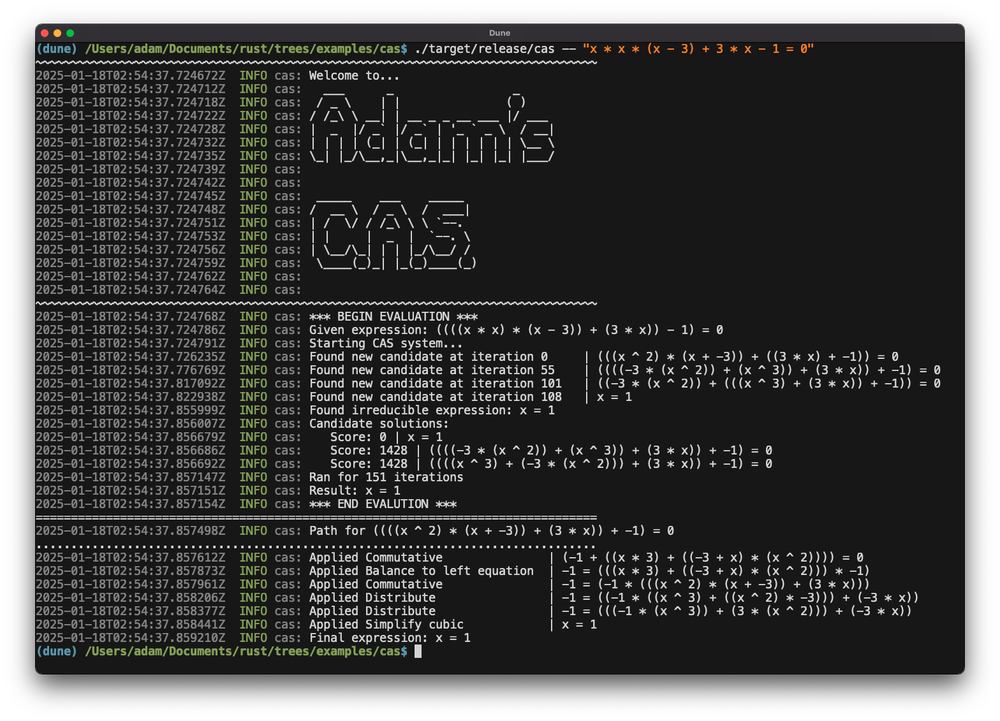

# trees

A library for tree data structures and tree-rewriting in Rust.

<!-- Include the three diagrams in the assets folder -->
<div align="center">
  <p float="left">
    
  </p>
    
    
  </p>
</div>

- **Author**: Adam McDaniel
- **GitHub**: [adam-mcdaniel/trees](https://github.com/adam-mcdaniel/trees)
- **License**: MIT

## Purpose

I wrote this library as a tool for creating programming languages and type-checkers. The library provides a decent tree data-structure, and convenient macros for applying rewrite rules.

To demonstrate and test the library, I implemented a tiny math expression evaluator, a lambda calculus interpreter (plus SKI combinator calculus compiler and interpreter), and a simple computer algebra system for evaluating complex algebraic expressions.

## Features

- **Tree data-structure**: A tree data-structure with a convenient API for traversing and manipulating trees.
- **Pattern matching**: Macros for matching trees against patterns.
- **Rewrite rules for patterns**: Using pattern matching, you can apply rewrite rules to trees.
- **Convenient macros**: Macros for building trees, defining patterns, and rewriting trees.

## Examples

### `tree!` macro

To create a tree of an arbitrary node type, you can use the `tree!` macro:

```rust
use trees::{tree, Tree};

fn main() {
    let tree = tree! {
        "head node";
        "child 1";
        "child 2";
        #[
            "subtree head node";
            "subtree child 1";
            "subtree child 2";
        ];
    };

    println!("{}", tree);
}
```

### `pattern!` macro

To define a pattern for matching trees, you can use the `pattern!` macro:

```rust
use trees::*;

fn main() {
    let tree = tree! {
        "head node";
        "child 1";
        "child 2";
        #[
            "subtree head node";
            "subtree child 1";
            "subtree child 2";
        ];
    };

    let pattern = pattern! {
        "head node";
        @first_child;
        ..
    };

    let matches = tree.does_match_pattern(&pattern);
    println!("Does \"{pattern}\" match? -> {matches:?}");

    let pattern2 = pattern! {
        "this won't match";
        ..
    };

    let matches2 = tree.does_match_pattern(&pattern2);
    println!("Does \"{pattern2}\" match? -> {matches2:?}");
}
```

### `rewrite!` macro

To apply a rewrite rule to a tree, you can use the `rewrite!` macro:

```rust
use std::fmt::Display;
use trees::*;

// The atoms of the expression tree for a simple calculator
#[derive(Clone, Debug, PartialEq)]
enum Atom {
    Add,
    Mul,
    Sub,
    Div,
    Num(i32),
}

impl Display for Atom {
    fn fmt(&self, f: &mut std::fmt::Formatter<'_>) -> std::fmt::Result {
        use Atom::*;
        match self {
            Add => write!(f, "+"),
            Mul => write!(f, "*"),
            Sub => write!(f, "-"),
            Div => write!(f, "/"),
            Num(n) => write!(f, "{}", n),
        }
    }
}

type Expr = Tree<Atom>;

fn commutative(expr: Expr) -> Expr {
    use Atom::*;
    // Apply the commutative property for Add and Mul operations
    let expr = rewrite!(
        expr,
        // Bind the matched subtree to `this` in the pattern
        this = pattern![
            // If the operation (head node) is Add or Mul
            @op if matches!(op, Add | Mul);
            // Bind the first child node to @a
            @a;
            // Bind the second child node to @b
            @b;
        ] => {
            // Print the matched subtree
            println!("Matched subtree: {}", this);
            // Return a new tree with the head node and children swapped
            tree![
                op.clone();
                b.clone();
                a.clone();
            ]
        // List the bound variables we want to use in the replacement expression.
        // To capture the bound variables as Trees, we use the `@` sigil.
        // To just grab their node value (Atom), we just use the plain identifier.
        } using op, @a, @b
        // ^ grabs the node value of `op`, and the `@a` and `@b` subtrees.
    );

    expr
}


fn main() {
    use Atom::*;
    // Create a tree representing the expression: 1 + (2 - 3) * 4
    let expr = tree![
        Add;
        Num(1);
        #[
            Mul;
            #[
                Sub;
                Num(2);
                Num(3);
            ];
            Num(4);
        ]
    ];

    // Apply the commutative property to the expression
    println!("Before commutative property: {}", expr);
    let expr = commutative(expr);
    println!("After commutative property: {}", expr);
}
```